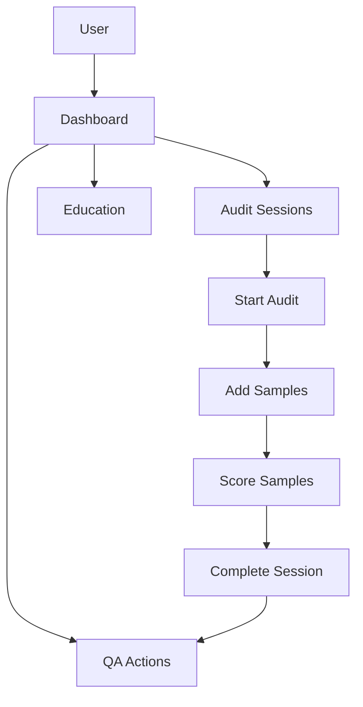
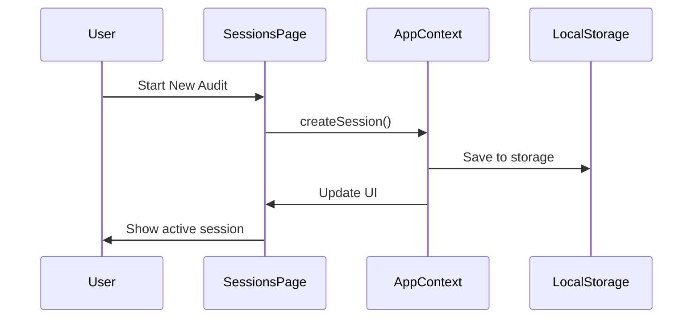

# Hub Health - Enhancement Implementation Guide

This guide provides step-by-step instructions for implementing the recommended enhancements to streamline workflow and reduce complexity.

## Table of Contents

1. [High Priority Enhancements](#high-priority-enhancements)
2. [Medium Priority Enhancements](#medium-priority-enhancements)
3. [Low Priority Enhancements](#low-priority-enhancements)
4. [Implementation Timeline](#implementation-timeline)

---

## High Priority Enhancements

### 1. Split Large Page Components

**Target Files:**
- `src/pages/SessionsPage.tsx` (64KB)
- `src/pages/UserGuidePage.tsx` (55KB)
- `src/pages/EduTopicLibraryPage.tsx` (36KB)

**Implementation Steps:**

#### A. SessionsPage Refactoring

Create the following new component files:

1. **`src/components/sessions/SessionHeader.tsx`**
   - Extract header section with filters and "Start New Audit" button
   - Props: `onNewSession`, `totalAudits`, `avgScore`, `passCount`, `needsReviewCount`

2. **`src/components/sessions/ActiveSessionPanel.tsx`**
   - Extract the entire active session editing interface
   - Props: `session`, `template`, `onUpdate`, `onComplete`, `onClose`, `onDelete`

3. **`src/components/sessions/SampleTable.tsx`**
   - Extract desktop table view for samples
   - Props: `samples`, `template`, `onUpdateAnswer`, `onScore`, `onDelete`, `isReadOnly`

4. **`src/components/sessions/SampleCards.tsx`**
   - Extract mobile card view for samples
   - Props: `samples`, `template`, `onUpdateAnswer`, `onScore`, `onDelete`, `isReadOnly`

5. **`src/components/sessions/ActionItemsList.tsx`**
   - Extract action items with competency recommendations
   - Props: `items`, `onUpdate`, `onToggleCompetency`, `onDelete`, `isReadOnly`

6. **`src/components/sessions/CorrectiveActionsForm.tsx`**
   - Extract corrective actions form
   - Props: `session`, `onUpdate`, `isReadOnly`

7. **`src/components/sessions/SessionHistory.tsx`**
   - Extract session history list with filters
   - Props: `sessions`, `onView`, `onDelete`, `onOpen`

8. **`src/components/sessions/SessionDetailModal.tsx`**
   - Extract session detail dialog
   - Props: `session`, `open`, `onOpenChange`, `onEdit`, `onDelete`

**Benefits:**
- Reduces SessionsPage from 1,600+ lines to ~200 lines
- Improves testability (can test each component independently)
- Enhances code reusability
- Makes code navigation easier

---

### 2. Expand Lazy Loading

**Current State:** Only 5 pages use lazy loading

**Implementation Steps:**

1. Update `src/App.tsx` to lazy load heavy pages:

```typescript
// Add these imports
const EduTopicLibraryPage = lazy(() => import('@/pages/EduTopicLibraryPage').then((m) => ({ default: m.EduTopicLibraryPage })));
const FollowUpPage = lazy(() => import('@/pages/FollowUpPage').then((m) => ({ default: m.FollowUpPage })));
const SettingsPage = lazy(() => import('@/pages/SettingsPage').then((m) => ({ default: m.SettingsPage })));
const TemplatesPage = lazy(() => import('@/pages/TemplatesPage').then((m) => ({ default: m.TemplatesPage })));
const QaActionsPage = lazy(() => import('@/pages/QaActionsPage').then((m) => ({ default: m.QaActionsPage })));
const RegulatoryReferencesPage = lazy(() => import('@/pages/RegulatoryReferencesPage').then((m) => ({ default: m.RegulatoryReferencesPage })));
const OrientationPage = lazy(() => import('@/pages/OrientationPage').then((m) => ({ default: m.OrientationPage })));
const EducationPage = lazy(() => import('@/pages/EducationPage').then((m) => ({ default: m.EducationPage })));
const CalendarPage = lazy(() => import('@/pages/CalendarPage').then((m) => ({ default: m.CalendarPage })));
```

2. Remove eager imports for these pages

3. Update loading fallback to be more informative:

```typescript
<Suspense fallback={
  <div className="flex items-center justify-center h-full">
    <div className="text-center space-y-2">
      <div className="animate-spin rounded-full h-8 w-8 border-b-2 border-primary mx-auto"></div>
      <p className="text-sm text-muted-foreground">Loading page...</p>
    </div>
  </div>
}>
```

**Benefits:**
- Reduces initial bundle size by ~150KB
- Faster initial page load
- Improved Time to Interactive (TTI)

---

### 3. Create Unified Database Management Script

**Current State:** Multiple npm scripts for D1 operations

**Implementation:**

Create `scripts/db-manager.mjs`:

```javascript
import { spawn } from 'child_process';
import readline from 'readline';

const rl = readline.createInterface({
  input: process.stdin,
  output: process.stdout
});

function runCommand(command, args = []) {
  return new Promise((resolve, reject) => {
    const child = spawn(command, args, { 
      stdio: 'inherit',
      shell: true 
    });
    
    child.on('close', (code) => {
      if (code !== 0) {
        reject(new Error(`Command failed with code ${code}`));
      } else {
        resolve();
      }
    });
  });
}

function ask(question) {
  return new Promise((resolve) => {
    rl.question(question, resolve);
  });
}

async function main() {
  console.log('\n🏥 Hub Health - Database Manager\n');
  console.log('Choose an operation:\n');
  console.log('1. Setup new D1 database');
  console.log('2. Apply local migrations');
  console.log('3. Apply remote migrations');
  console.log('4. Verify remote database');
  console.log('5. Run health check');
  console.log('6. Full setup (setup + local + remote + verify)');
  console.log('7. Development workflow (local + health check)');
  console.log('8. Exit\n');
  
  const choice = await ask('Enter choice (1-8): ');
  
  try {
    switch(choice) {
      case '1':
        console.log('\n📦 Creating D1 database...');
        await runCommand('wrangler', ['d1', 'create', 'hub-health']);
        console.log('\n✅ Database created! Copy the database_id to wrangler.toml');
        break;
        
      case '2':
        console.log('\n📝 Applying local migrations...');
        await runCommand('npm', ['run', 'd1:migrate:local']);
        console.log('\n✅ Local migrations applied!');
        break;
        
      case '3':
        console.log('\n☁️  Applying remote migrations...');
        await runCommand('npm', ['run', 'd1:migrate:remote']);
        console.log('\n✅ Remote migrations applied!');
        break;
        
      case '4':
        console.log('\n🔍 Verifying remote database...');
        await runCommand('npm', ['run', 'd1:verify:remote']);
        console.log('\n✅ Remote database verified!');
        break;
        
      case '5':
        console.log('\n🏥 Running health check...');
        await runCommand('npm', ['run', 'd1:health']);
        console.log('\n✅ Health check complete!');
        break;
        
      case '6':
        console.log('\n🚀 Running full setup...');
        const dbName = await ask('Enter database name (default: hub-health): ') || 'hub-health';
        await runCommand('wrangler', ['d1', 'create', dbName]);
        console.log('\n⏳ Waiting for database creation...');
        await new Promise(resolve => setTimeout(resolve, 2000));
        await runCommand('npm', ['run', 'd1:migrate:local']);
        await runCommand('npm', ['run', 'd1:migrate:remote']);
        await runCommand('npm', ['run', 'd1:verify:remote']);
        console.log('\n✅ Full setup complete!');
        break;
        
      case '7':
        console.log('\n💻 Running development workflow...');
        await runCommand('npm', ['run', 'd1:migrate:local']);
        await runCommand('npm', ['run', 'd1:health']);
        console.log('\n✅ Development environment ready!');
        break;
        
      case '8':
        console.log('\n👋 Goodbye!');
        break;
        
      default:
        console.log('\n❌ Invalid choice');
    }
  } catch (error) {
    console.error('\n❌ Error:', error.message);
    process.exit(1);
  }
  
  rl.close();
}

main();
```

**Update package.json:**

```json
"scripts": {
  "db": "node scripts/db-manager.mjs",
  // ... existing scripts
}
```

**Usage:**
```bash
npm run db
```

**Benefits:**
- Single command for all database operations
- Interactive menu reduces cognitive load
- Common workflows (dev, full setup) automated
- Clear feedback and error handling

---

### 4. Implement Autosave Functionality

**Implementation:**

Create `src/hooks/use-autosave.ts`:

```typescript
import { useEffect, useRef, useCallback } from 'react';
import { useToast } from '@/hooks/use-toast';

interface AutosaveOptions {
  data: any;
  onSave: (data: any) => Promise<void> | void;
  interval?: number; // milliseconds
  enabled?: boolean;
}

export function useAutosave({
  data,
  onSave,
  interval = 30000, // 30 seconds default
  enabled = true
}: AutosaveOptions) {
  const { toast } = useToast();
  const lastSavedData = useRef<string>(JSON.stringify(data));
  const isSaving = useRef(false);
  const saveTimeoutRef = useRef<NodeJS.Timeout>();

  const save = useCallback(async () => {
    if (isSaving.current || !enabled) return;
    
    const currentData = JSON.stringify(data);
    if (currentData === lastSavedData.current) return;

    isSaving.current = true;
    
    try {
      await onSave(data);
      lastSavedData.current = currentData;
      toast({
        title: "Autosaved",
        description: "Your changes have been saved.",
        duration: 2000,
      });
    } catch (error) {
      console.error('Autosave failed:', error);
      toast({
        title: "Autosave failed",
        description: "Failed to save changes. Please save manually.",
        variant: "destructive",
      });
    } finally {
      isSaving.current = false;
    }
  }, [data, onSave, enabled, toast]);

  useEffect(() => {
    if (!enabled) return;

    // Clear existing timeout
    if (saveTimeoutRef.current) {
      clearTimeout(saveTimeoutRef.current);
    }

    // Schedule next save
    saveTimeoutRef.current = setTimeout(save, interval);

    return () => {
      if (saveTimeoutRef.current) {
        clearTimeout(saveTimeoutRef.current);
      }
    };
  }, [data, save, interval, enabled]);

  // Manual save function
  const saveNow = useCallback(() => {
    save();
  }, [save]);

  return { saveNow };
}
```

**Update AppContext to support autosave:**

Create `src/contexts/AutosaveContext.tsx`:

```typescript
import { createContext, useContext, ReactNode } from 'react';
import { useApp } from './AppContext';
import { useAutosave } from '@/hooks/use-autosave';

const AutosaveContext = createContext<{ saveNow: () => void } | undefined>(undefined);

export function AutosaveProvider({ children }: { children: ReactNode }) {
  const { sessions, qaActions, eduSessions } = useApp();

  const { saveNow } = useAutosave({
    data: { sessions, qaActions, eduSessions },
    onSave: async (data) => {
      // Save to localStorage
      localStorage.setItem('hub-health-autosave', JSON.stringify({
        ...data,
        timestamp: new Date().toISOString()
      }));
      
      // TODO: Optionally sync to Cloudflare D1 when backend is ready
      // await fetch('/api/autosave', {
      //   method: 'POST',
      //   body: JSON.stringify(data)
      // });
    },
    interval: 30000, // 30 seconds
    enabled: true
  });

  return (
    <AutosaveContext.Provider value={{ saveNow }}>
      {children}
    </AutosaveContext.Provider>
  );
}

export function useAutosaveContext() {
  const context = useContext(AutosaveContext);
  if (!context) {
    throw new Error('useAutosaveContext must be used within AutosaveProvider');
  }
  return context;
}
```

**Update App.tsx:**

```typescript
import { AutosaveProvider } from '@/contexts/AutosaveContext';

function App() {
  return (
    <AppProvider>
      <AutosaveProvider>
        <AppContent />
        <Toaster />
        <Sonner />
      </AutosaveProvider>
    </AppProvider>
  );
}
```

**Add recovery on app load:**

Update `AppProvider` to check for autosaved data:

```typescript
useEffect(() => {
  const autosaved = localStorage.getItem('hub-health-autosave');
  if (autosaved) {
    try {
      const { sessions, qaActions, eduSessions, timestamp } = JSON.parse(autosaved);
      const autosavedDate = new Date(timestamp);
      const now = new Date();
      const hoursDiff = (now.getTime() - autosavedDate.getTime()) / (1000 * 60 * 60);
      
      // Only restore if within 24 hours
      if (hoursDiff < 24) {
        // Show recovery dialog
        const shouldRestore = window.confirm(
          `Found autosaved data from ${autosavedDate.toLocaleString()}. Would you like to restore it?`
        );
        
        if (shouldRestore) {
          setSessions(sessions || []);
          setQaActions(qaActions || []);
          setEduSessions(eduSessions || []);
        }
      }
    } catch (error) {
      console.error('Failed to restore autosave:', error);
    }
  }
}, []);
```

**Benefits:**
- Automatic data persistence every 30 seconds
- Recovery from accidental closures
- Reduces data loss risk
- Works offline (localStorage)
- Ready for cloud sync integration

---

## Medium Priority Enhancements

### 5. Split AppContext into Domain-Specific Contexts

**Implementation:**

Create separate context files:

1. **`src/contexts/SessionsContext.tsx`**
   - Manages audit sessions
   - Methods: createSession, updateSession, deleteSession, completeSession

2. **`src/contexts/QaActionsContext.tsx`**
   - Manages QA actions
   - Methods: createAction, updateAction, deleteAction, completeAction

3. **`src/contexts/EducationContext.tsx`**
   - Manages education sessions
   - Methods: createEduSession, updateEduSession, deleteEduSession

4. **`src/contexts/TemplatesContext.tsx`**
   - Manages audit templates
   - Methods: createTemplate, updateTemplate, archiveTemplate

5. **`src/contexts/NavigationContext.tsx`**
   - Manages UI state (activeTab, sidebar state, etc.)

**Example structure:**

```typescript
// src/contexts/SessionsContext.tsx
import { createContext, useContext, useState, ReactNode } from 'react';
import type { AuditSession } from '@/types/nurse-educator';

interface SessionsContextType {
  sessions: AuditSession[];
  createSession: (session: AuditSession) => void;
  updateSession: (id: string, updates: Partial<AuditSession>) => void;
  deleteSession: (id: string) => void;
  getSession: (id: string) => AuditSession | undefined;
}

const SessionsContext = createContext<SessionsContextType | undefined>(undefined);

export function SessionsProvider({ children }: { children: ReactNode }) {
  const [sessions, setSessions] = useState<AuditSession[]>([]);

  const createSession = (session: AuditSession) => {
    setSessions(prev => [session, ...prev]);
  };

  const updateSession = (id: string, updates: Partial<AuditSession>) => {
    setSessions(prev => prev.map(s => 
      s.id === id ? { ...s, ...updates } : s
    ));
  };

  const deleteSession = (id: string) => {
    setSessions(prev => prev.filter(s => s.id !== id));
  };

  const getSession = (id: string) => {
    return sessions.find(s => s.id === id);
  };

  return (
    <SessionsContext.Provider value={{
      sessions,
      createSession,
      updateSession,
      deleteSession,
      getSession
    }}>
      {children}
    </SessionsContext.Provider>
  );
}

export function useSessions() {
  const context = useContext(SessionsContext);
  if (!context) {
    throw new Error('useSessions must be used within SessionsProvider');
  }
  return context;
}
```

---

### 6. Enhance Command Palette

**Implementation:**

Update `src/components/CommandPalette.tsx`:

```typescript
import { useEffect, useState } from 'react';
import { useNavigate } from 'react-router-dom';
import { Command, CommandDialog, CommandEmpty, CommandGroup, CommandInput, CommandItem, CommandList } from '@/components/ui/command';
import { 
  Play, 
  FileText, 
  GraduationCap, 
  Calendar, 
  Settings,
  AlertTriangle,
  BarChart,
  CheckSquare,
  BookOpen,
  Users
} from 'lucide-react';

export function CommandPalette() {
  const [open, setOpen] = useState(false);
  const navigate = useNavigate();

  useEffect(() => {
    const down = (e: KeyboardEvent) => {
      if (e.key === 'k' && (e.metaKey || e.ctrlKey)) {
        e.preventDefault();
        setOpen((open) => !open);
      }
    };

    document.addEventListener('keydown', down);
    return () => document.removeEventListener('keydown', down);
  }, []);

  const commands = [
    // Navigation
    { group: 'Navigation', items: [
      { label: 'Dashboard', icon: BarChart, action: () => navigate('/dashboard') },
      { label: 'Audit Sessions', icon: FileText, action: () => navigate('/sessions') },
      { label: 'QA Actions', icon: AlertTriangle, action: () => navigate('/qa-actions') },
      { label: 'Education', icon: GraduationCap, action: () => navigate('/education') },
      { label: 'Calendar', icon: Calendar, action: () => navigate('/calendar') },
      { label: 'Analytics', icon: BarChart, action: () => navigate('/analytics') },
      { label: 'Settings', icon: Settings, action: () => navigate('/settings') },
    ]},
    
    // Quick Actions
    { group: 'Quick Actions', items: [
      { label: 'Start New Audit', icon: Play, action: () => navigate('/sessions?action=new') },
      { label: 'Create Template', icon: FileText, action: () => navigate('/templates?action=new') },
      { label: 'Schedule Education', icon: GraduationCap, action: () => navigate('/education?action=new') },
      { label: 'View All Templates', icon: BookOpen, action: () => navigate('/templates') },
    ]},
    
    // Data Management
    { group: 'Data Management', items: [
      { label: 'Export Data', icon: CheckSquare, action: () => console.log('Export data') },
      { label: 'Import Data', icon: CheckSquare, action: () => console.log('Import data') },
      { label: 'Backup Now', icon: CheckSquare, action: () => console.log('Backup') },
    ]},
  ];

  return (
    <CommandDialog open={open} onOpenChange={setOpen}>
      <CommandInput placeholder="Type a command or search..." />
      <CommandList>
        <CommandEmpty>No results found.</CommandEmpty>
        {commands.map((group) => (
          <CommandGroup key={group.group} heading={group.group}>
            {group.items.map((item) => (
              <CommandItem
                key={item.label}
                onSelect={() => {
                  item.action();
                  setOpen(false);
                }}
              >
                <item.icon className="mr-2 h-4 w-4" />
                <span>{item.label}</span>
              </CommandItem>
            ))}
          </CommandGroup>
        ))}
      </CommandList>
    </CommandDialog>
  );
}
```

---

### 7. Add Comprehensive Test Coverage

**Setup:**

```bash
npm install --save-dev @testing-library/user-event
```

**Example test file:**

Create `src/components/sessions/__tests__/SessionHeader.test.tsx`:

```typescript
import { render, screen, fireEvent } from '@testing-library/react';
import { SessionHeader } from '../SessionHeader';
import { describe, it, expect, vi } from 'vitest';

describe('SessionHeader', () => {
  it('displays audit statistics correctly', () => {
    render(
      <SessionHeader
        totalAudits={10}
        avgScore={85}
        passCount={8}
        needsReviewCount={2}
        onNewSession={vi.fn()}
      />
    );

    expect(screen.getByText(/Total: 10/i)).toBeInTheDocument();
    expect(screen.getByText(/Avg: 85%/i)).toBeInTheDocument();
    expect(screen.getByText(/Pass: 8/i)).toBeInTheDocument();
  });

  it('calls onNewSession when button is clicked', () => {
    const handleNewSession = vi.fn();
    render(
      <SessionHeader
        totalAudits={0}
        avgScore={0}
        passCount={0}
        needsReviewCount={0}
        onNewSession={handleNewSession}
      />
    );

    fireEvent.click(screen.getByText(/Start New Audit/i));
    expect(handleNewSession).toHaveBeenCalledTimes(1);
  });
});
```

---

### 8. Consolidate CSS Approaches

**Implementation:**

1. Remove `src/App.css` if not used
2. Move all component-specific styles to Tailwind classes
3. Keep only global CSS variables in `src/index.css`

**Update `src/index.css` to keep only:**

```css
@tailwind base;
@tailwind components;
@tailwind utilities;

@layer base {
  :root {
    /* Theme variables */
    --background: 0 0% 100%;
    --foreground: 222.2 84% 4.9%;
    /* ... other CSS variables */
  }

  .dark {
    /* Dark theme variables */
  }
}

/* Keep only animation utilities */
@layer utilities {
  .animate-fade-in {
    animation: fadeIn 0.3s ease-in;
  }

  @keyframes fadeIn {
    from { opacity: 0; }
    to { opacity: 1; }
  }
}
```

---

## Low Priority Enhancements

### 9. Create Visual Workflow Documentation

**Tool Suggestion:** Use Mermaid diagrams in markdown

Create `docs/ARCHITECTURE.md`:

```markdown
# Hub Health Architecture

## Application Flow



## Data Flow


```

---

### 10. Build Developer CLI Tool

Extend the database manager into a full CLI:

```bash
npm run cli
```

Options:
- Database operations
- Generate components
- Run migrations
- Build/deploy commands
- Test runners

---

### 11. Implement Progressive Feature Disclosure

**Implementation:**

Create user onboarding flow:

1. First-time user sees simplified dashboard
2. Features unlock as user completes actions
3. Settings to enable "Pro Mode" for power users

---

### 12. Add Staging Environment

**Update `wrangler.toml`:**

```toml
[env.staging]
name = "hub-health-staging"

[env.staging.d1_databases]
binding = "DB"
database_name = "hub-health-staging"
database_id = "your-staging-db-id"
```

**Add npm scripts:**

```json
"deploy:staging": "wrangler deploy --env staging",
"deploy:production": "wrangler deploy --env production"
```

---

## Implementation Timeline

### Week 1-2: High Priority
- [ ] Day 1-3: Split SessionsPage components
- [ ] Day 4: Implement lazy loading
- [ ] Day 5: Create database manager script
- [ ] Day 6-7: Implement autosave

### Week 3-4: Medium Priority
- [ ] Day 1-3: Split contexts
- [ ] Day 4: Enhance command palette
- [ ] Day 5-7: Add test coverage

### Week 5+: Low Priority
- Documentation improvements
- CLI tool development
- Progressive disclosure
- Staging environment

---

## Testing Checklist

Before deploying each enhancement:

- [ ] All TypeScript errors resolved
- [ ] Tests passing
- [ ] No console errors
- [ ] Responsive design verified
- [ ] Performance improvements measured
- [ ] User experience tested
- [ ] Documentation updated

---

## Rollback Plan

If any enhancement causes issues:

1. Use Git to revert specific commits
2. Keep feature flags for gradual rollout
3. Monitor error logs in Cloudflare dashboard
4. Have database backups before major changes

---

## Support

For questions or issues during implementation:
- Review this guide
- Check component documentation
- Review Git commit history
- Test in development environment first
